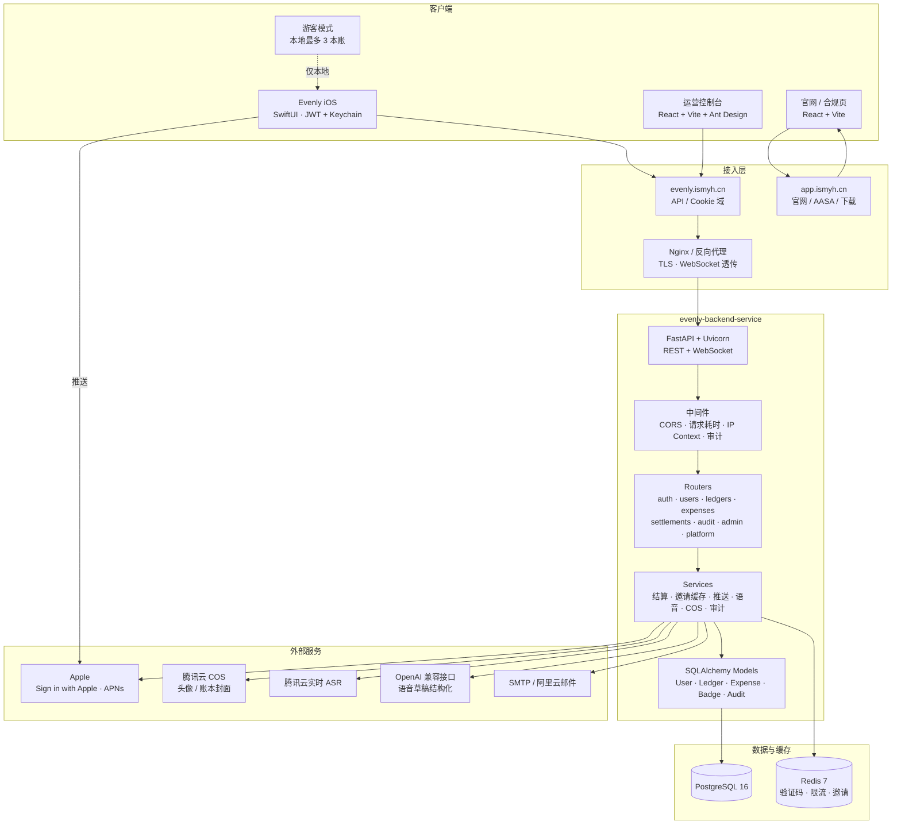
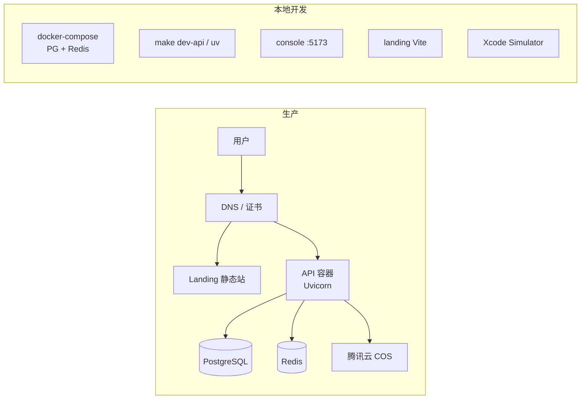
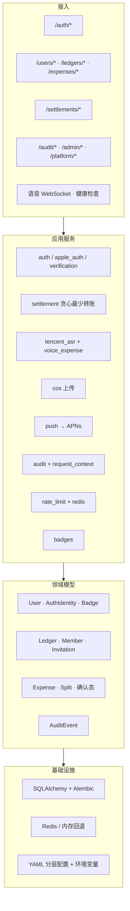
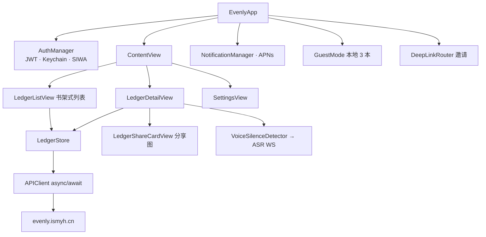
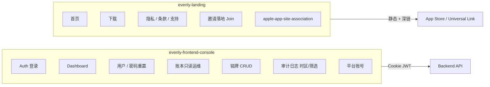
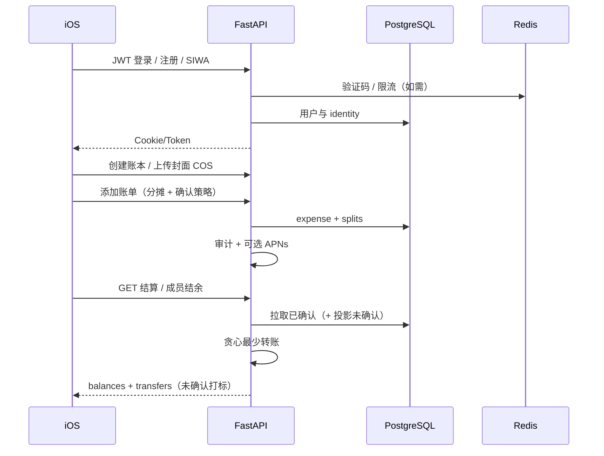

# Evenly 架构图与技术选型

最后更新：2026-07-20

Evenly 是多人协作记账与分账平台。本文档描述当前 monorepo 的系统架构、部署拓扑与技术选型。

## 仓库组成

| 目录 | 职责 |
| --- | --- |
| `evenly-backend-service/` | FastAPI 后端：账本、账单、结算、认证、审计、运营 API |
| `Evenly/` | iOS / iPadOS 客户端（SwiftUI） |
| `evenly-frontend-console/` | 运营控制台（React + Vite + Ant Design） |
| `evenly-landing/` | 官网、合规页、下载与 Universal Link（AASA） |

---

## 1. 系统总览



---

## 2. 部署与域名

| 组件 | 域名 / 入口 | 说明 |
| --- | --- | --- |
| API | `https://evenly.ismyh.cn` | iOS Release、控制台共用后端 |
| 官网 | `app.ismyh.cn`（及落地页路由） | 下载、隐私、条款、支持、Universal Link（AASA） |
| 本地 API | `http://localhost:8000` | iOS Debug 默认；可用 `EVENLY_API_BASE_URL` 覆盖 |
| 镜像 | 阿里云 ACR | Docker 多架构构建；GitHub Actions CI |



---

## 3. 后端分层



### 核心业务语义

- **账本**：成员、邀请链接/码、封面、`require_confirmation`
- **账单**：付款人 / 分摊、收入与部分退款、`pending / confirmed / rejected`
- **结算**：以已确认账单为主；投影流向可含未确认并打标；成员结余与转账建议对齐
- **账号**：普通用户 vs 平台运营（`account_kind`）；铭牌（badge）定义与用户佩戴
- **审计**：写库事件 + 请求 IP / Client 上下文

### 后端目录要点

```
evenly-backend-service/
├── main.py                 # FastAPI 入口，中间件、异常处理
├── app/
│   ├── config.py           # YAML + 环境变量分层配置
│   ├── database.py         # SQLAlchemy engine / session
│   ├── models/             # user, ledger, expense, settlement, audit, badge
│   ├── schemas/            # Pydantic 请求 / 响应
│   ├── routers/            # auth, users, ledgers, expenses, settlements, audit, admin, platform
│   ├── services/           # 业务：auth, settlement, cos, asr, push, audit, ...
│   └── utils/deps.py       # 依赖注入
├── alembic/                # 数据库迁移
├── docker-compose.yml      # 本地 PostgreSQL + Redis
└── Dockerfile
```

---

## 4. iOS 客户端结构



| 层次 | 选型 |
| --- | --- |
| UI | SwiftUI |
| 状态 | `@StateObject` / `@EnvironmentObject` / `@Published` |
| 网络 | 自研 `APIClient` + async/await |
| 鉴权 | JWT（Keychain）；Sign in with Apple |
| 媒体 | COS URL + `AsyncImage`；封面/头像 |
| 推送 | APNs |
| 游客 | 本地持久化，不上云 |
| Bundle ID | `com.yhma.Evenly` |

---

## 5. 控制台与官网



---

## 6. 技术选型一览

### 6.1 后端

| 类别 | 选型 | 选型理由 |
| --- | --- | --- |
| 语言 | **Python 3.12+** | 业务迭代快、生态齐（ORM/云 SDK/语音） |
| API 框架 | **FastAPI + Uvicorn** | 类型友好、OpenAPI 自带、WebSocket 易接 ASR |
| 校验 | **Pydantic v2** | 与 FastAPI 一体，请求/响应契约清晰 |
| ORM | **SQLAlchemy 2.0** | 成熟、适合账本/分摊等关系模型 |
| 迁移 | **Alembic** | 版本化 schema；启动不自动建表 |
| 数据库 | **PostgreSQL 16** | 事务可靠、索引友好、适合结算与审计 |
| 缓存 | **Redis 7** | 验证码、限流、邀请；未配则内存回退（仅本地） |
| 认证 | **JWT + Cookie**；邮箱验证码；**Sign in with Apple** | Web 控制台 Cookie、iOS Token 双端；App Store 合规 |
| 密码 | **passlib/bcrypt** | 标准哈希 |
| 对象存储 | **腾讯云 COS** | 国内访问、头像/封面 |
| 邮件 | **SMTP（阿里云 DirectMail 兼容）** | 验证码/通知 |
| 语音 | **腾讯实时 ASR + OpenAI 兼容 LLM** | 流式转写 → 结构化费用草稿 |
| 推送 | **APNs** | iOS 账单/成员通知 |
| 依赖/包管 | **uv** | 快、锁文件可复现 |
| 容器 | **Docker + compose** | 本地 PG/Redis；生产镜像推 ACR |
| 测试 | **pytest** | 规则/推送/Redis 等 |
| CI | **GitHub Actions** | 测试、迁移 SQL 校验、密钥扫描 |

### 6.2 iOS

| 类别 | 选型 | 选型理由 |
| --- | --- | --- |
| UI | **SwiftUI** | 声明式、迭代快，适合表单/列表/分享卡 |
| 并发网络 | **async/await** | 与后端 REST 对齐 |
| 安全存储 | **Keychain** | JWT 不进明文 UserDefaults |
| 身份 | **Sign in with Apple + 邮箱** | 商店要求 + 国内用户习惯 |
| 本地游客 | **本地 Store** | 零注册试用，限制 3 本账 |

### 6.3 运营控制台

| 类别 | 选型 | 选型理由 |
| --- | --- | --- |
| 框架 | **React 19** | 组件化后台 |
| 构建 | **Vite 7** | 开发体验与构建速度 |
| UI | **Ant Design 6** | 表格、表单、权限型后台成熟 |
| 时间 | **dayjs + 时区** | 审计按上海日历日筛选 |
| 动效 | **Rive** | 登录等轻量动效 |
| 测试 | **Vitest** | 与 Vite 一体 |

### 6.4 官网

| 类别 | 选型 | 选型理由 |
| --- | --- | --- |
| 栈 | **React + Vite** | 与控制台技术同族，维护成本低 |
| 图标 | **lucide-react** | 轻量 |
| 合规 | 静态页 + **AASA** | 隐私/条款/支持、Universal Link |

### 6.5 横切能力

| 能力 | 实现要点 |
| --- | --- |
| 配置 | `config.defaults.yaml` + 本地 `config.yaml` + 环境变量（`__` 嵌套） |
| 审计 | `audit_events` 表；中间件绑定 IP / Client |
| 限流 | Redis 计数；无 Redis 时内存 |
| 结算算法 | 服务端贪心最少转账；确认态与投影未确认分流 |
| 媒体 URL | COS；客户端统一解析展示 |
| 运维账号 | `account_kind` 平台用户；控制台非邮件白名单模式 |

---

## 7. 数据域（简化 ER）

```mermaid
erDiagram
  USER ||--o{ AUTH_IDENTITY : has
  USER ||--o| BADGE_DEF : wears
  USER ||--o{ LEDGER_MEMBER : joins
  LEDGER ||--o{ LEDGER_MEMBER : has
  LEDGER ||--o{ EXPENSE : contains
  EXPENSE ||--o{ EXPENSE_SPLIT : splits
  LEDGER ||--o{ INVITATION : invites
  USER ||--o{ AUDIT_EVENT : acts
  USER ||--o{ PUSH_DEVICE : registers
  BADGE_DEF ||--o{ USER : assigned

  USER {
    uuid id
    string email
    string username
    string badge
    string account_kind
  }
  LEDGER {
    uuid id
    string name
    string cover_url
    bool require_confirmation
  }
  EXPENSE {
    uuid id
    decimal amount
    string status
    decimal refund_amount
  }
  AUDIT_EVENT {
    uuid id
    string action
    string ip
    timestamptz created_at
  }
```



---

## 8. 请求主路径（记账 → 结算）



---

## 9. 选型原则

1. **单后端多端**：iOS + 控制台共用一套 FastAPI，领域逻辑（结算、确认、审计）集中在服务端。
2. **强一致账务在 PG**：账单、分摊、成员关系走关系库；Redis 只做短生命周期状态。
3. **云能力按需接国内栈**：COS / 腾讯 ASR / 阿里邮件，延迟与合规更贴合目标用户。
4. **客户端偏薄**：SwiftUI 负责体验（书架、分享图、语音采集）；规则以后端为准。
5. **运维与用户面分离**：平台账号 + 控制台；普通用户无 admin 邮箱特权。
6. **可演进**：Alembic 迁移、Docker/CI、配置分层，便于上线与回滚。

---

## 10. 相关文档

| 文档 | 路径 |
| --- | --- |
| 后端 README | `evenly-backend-service/README.md` |
| iOS 功能文档 | `Evenly/README.md` |
| 后端开发说明 | `evenly-backend-service/DEVELOPMENT.md` |
| 数据库说明 | `evenly-backend-service/DATABASE.md` |
| 语音记账 | `evenly-backend-service/VOICE_EXPENSE.md` |
| 可分享幻灯片 | `docs/Evenly-Architecture.pptx` |
